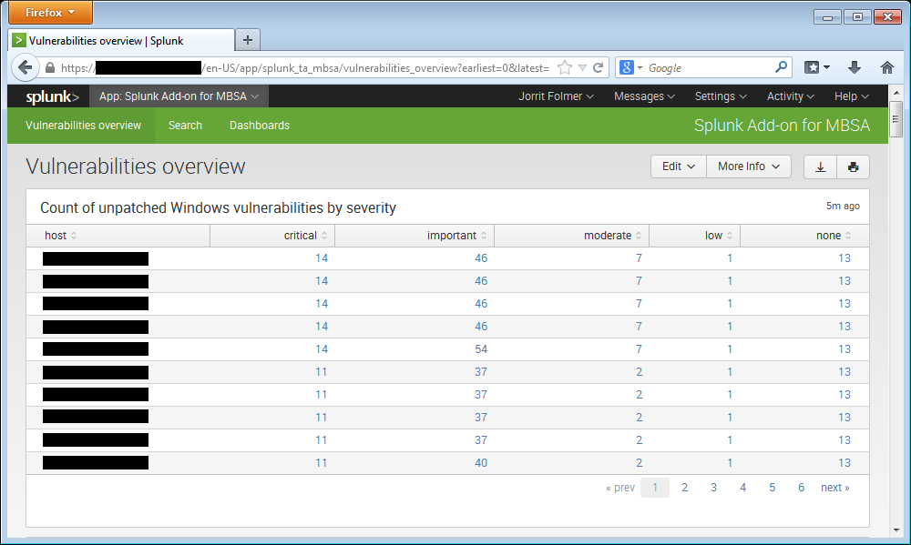

# Splunk TA for Microsoft Baseline Security Analyzer

This Splunk TA is meant as a reporting control for patch management on Microsoft Windows servers.
To this end, Microsoft Baseline Security Analyzer (MBSA) is used to report on missing Microsoft Security Bulletins and KBs.

## Prerequisites

1. [Download MBSA from Microsoft](https://www.microsoft.com/en-us/download/details.aspx?id=7558)
2. [Download wsusscn2.cab from Microsoft](http://go.microsoft.com/fwlink/?LinkId=76054)

## Installation

1. Install this Splunk TA on your indexer(s), or manually include the provided props.conf to your indexer config,
2. Install this Splunk TA on your search head to get the vulnerabilities overview dashboard,
3. Install this Splunk TA on your deployment server:

    ````
    cd $SPLUNK_HOME/etc/deployment-apps`
    git clone https://github.com/jorritfolmer/splunk_ta_mbsa.git
    ````

    * Copy `mbsacli.exe` and `wsusscan.dll` to the Splunk deployment server in `$SPLUNK_HOME/etc/deployment-apps/splunk_ta_mbsa/bin`
    * Enable the scripted input on the deployment server by setting `disabled = 0` in `$SPLUNK_HOME/etc/deployment-apps/splunk_ta_mbsa/default/inputs.conf`
    * `/opt/splunk/bin/splunk reload deploy-server`
    * Create a serverclass (e.g. `mbsa`) on the deployment-server
    * Assign this app to the serverclass
    * Assign clients the serverclass
4. (If you don't have a WSUS server: put the wsusscn2.cab on an internal webserver)

## Dashboard




## Configuration

By default, this addon runs once a week on every client the addon is deployed on. To lessen the load on the internal webserver that hosts the wsusscn2.cab file, a random wait of 1-3600 seconds is first executed.

1. Interval: edit `$SPLUNK_HOME/etc/deployment-apps/splunk_ta_mbsa/default/inputs.conf`
2. Random wait: edit the second line of `$SPLUNK_HOME/etc/deployment-apps/splunk_ta_mbsa/bin/mbsa.cmd`
3. Wsusscn2.cab download location:  `$SPLUNK_HOME/etc/deployment-apps/splunk_ta_mbsa/bin/mbsa.cmd`

